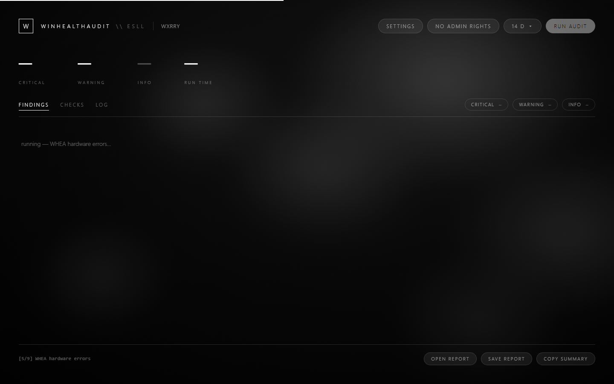
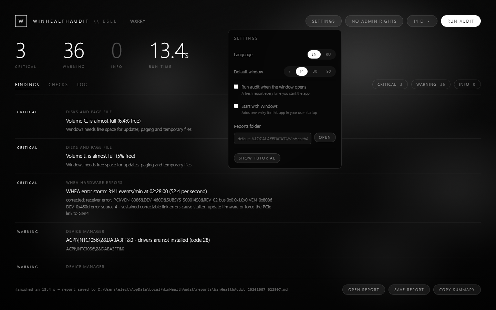
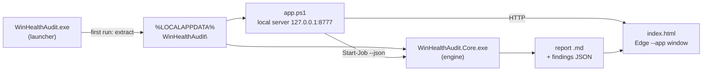
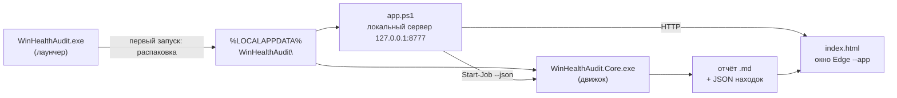

<div align="center">


# WinHealthAudit

**WINHEALTHAUDIT \ ESLL**

A read-only Windows health report — one executable, one markdown file.


[](https://github.com/wxrrry/ESLL-WinHealthAudit/actions/workflows/build.yml)


[](https://github.com/wxrrry/ESLL-WinHealthAudit/issues)

**No installer. No service. No driver. No telemetry. Nothing leaves your machine.**

</div>

---

## Contents

- [Features](#features)
- [Screenshots](#screenshots)
- [What it checks](#what-it-checks)
- [Quick start](#quick-start)
- [Settings](#settings)
- [Command line](#command-line)
- [Build from source](#build-from-source)
- [Architecture](#architecture)
- [Troubleshooting](#troubleshooting)
- [Notes](#notes)
- [Contributing](#contributing)
- [License](#license)
- [Русская версия](#русская-версия)

## Features

- **One file.** `WinHealthAudit.exe` contains the window, the interface and the
  audit engine. Double-click and it unpacks itself into
  `%LOCALAPPDATA%\WinHealthAudit`.
- **Read-only.** It walks event logs, WMI classes and performance counters and
  writes findings into a markdown report. No service is stopped, no setting is
  changed, no log is cleared, no registry key is written (except an optional
  *Start with Windows* entry you switch on yourself).
- **Nine checks, one severity scale.** `Info < Warning < Critical`, findings
  sorted so the worst ones sit on top, each with its source and evidence.
- **Black and white, keyboard-friendly window** in an Edge `--app` view —
  *Findings*, *Checks*, *Log*, report buttons, period and language pickers.
  No Edge? The window opens in your default browser instead.
- **EN / RU interface.** The audit output stays in English (it is what the
  system logs say), the interface switches in Settings.
- **Guided tour on first run** and a splash screen; both are replayable from
  the menu.
- **Optional administrator mode.** Everything works as a normal user; run
  elevated for SMART disk attributes and protected logs. The header pill shows
  which mode you are in, and an elevated relaunch takes over the local port
  from the plain one.
- **A real command-line engine** underneath: `WinHealthAudit.Core.exe` prints
  the same report to a file or one JSON document to stdout — exit code is the
  number of critical findings.

## Screenshots

<p align="center">
  
</p>

<p align="center">
  <em>Findings — every row carries its source, evidence and a copy button.</em>
</p>

<table align="center">
  <tr>
    <td width="50%"></td>
    <td width="50%"></td>
  </tr>
  <tr>
    <td align="center"><em>Settings — period, language, start options, report folder.</em></td>
    <td align="center"><em>Guided tour on the first run.</em></td>
  </tr>
</table>

## What it checks

| Check | What you get |
| --- | --- |
| System info | OS build, install date, uptime, memory size, elevation state |
| Hardware | CPU, memory speed vs rated speed, firmware date, GPUs, driver ages, VRAM |
| Disks and page file | disk health, free space, page files (including stale ones), queue length |
| Performance counters | CPU / DPC / interrupt load, free memory, pool sizes, process queue |
| WHEA hardware errors | PCIe correctable errors decoded with device, rate and time of the worst minute |
| Event logs | error events grouped by provider and id, with counts and known-issue rules |
| Device manager | problem codes with a plain-language description |
| Processes, services and startup | top CPU and memory, stopped automatic services, Run keys |
| System state | pending reboot, power scheme, Defender, activation |

Severity is `Info` < `Warning` < `Critical`. Findings you have not seen before
are still reported, just at a lower priority than the ones with a known cause.

## Quick start

> [!IMPORTANT]
> The executable is unsigned. On the first run Windows shows **"Windows
> protected your PC"** (SmartScreen) — press **More info → Run anyway**. This
> is the only scary screen you will see.

1. Get `WinHealthAudit.exe`
   from the [Releases](https://github.com/wxrrry/ESLL-WinHealthAudit/releases)
   page — or build it yourself in one second: [`build.cmd`](build.cmd).
2. Double-click it. The first run unpacks the interface and the engine into
   `%LOCALAPPDATA%\WinHealthAudit` and opens the window.
3. Pick a period, press **Run audit**, read the findings, **Save report**.

Already running? Launching the exe again just opens a second window on the
same local server — nothing doubles.

<details>
<summary>Administrator mode</summary>

Right-click the exe → **Run as administrator** if you want SMART attributes
and the full picture of protected logs. The pill in the header switches from
"without administrator rights" to "administrator", and the elevated instance
takes over the local port from the plain one automatically.

</details>

## Settings

| Setting | What it does |
| --- | --- |
| Period | how far back the audit looks: 7 / 14 / 30 / 90 days |
| Language | EN / RU interface, remembered between launches |
| Run audit at launch | start a run as soon as the window opens |
| Start with Windows | adds/removes a `WinHealthAudit` entry under `HKCU\...\Run` |
| Report folder | where markdown reports are written |

Everything is stored in `%LOCALAPPDATA%\WinHealthAudit\settings.json`.
Reports land in `%LOCALAPPDATA%\WinHealthAudit\reports\` as
`WinHealthAudit-YYYYMMDD-HHMMSS.md` (UTF-8 with BOM — opens correctly in
Notepad).

## Command line

The same nine checks without the window — `WinHealthAudit.Core.exe`:

```
WinHealthAudit.Core.exe
WinHealthAudit.Core.exe --days 30
WinHealthAudit.Core.exe --out C:\temp --quiet
WinHealthAudit.Core.exe --json --days 7   # one JSON document on stdout
```

| Option | Meaning |
| --- | --- |
| `-d`, `--days N` | look back N days in the event logs (default 14, max 365) |
| `-o`, `--out DIR` | where to write the markdown report (default `.\reports`) |
| `-q`, `--quiet` | print only the progress lines and the summary |
| `--json` | the result as one JSON document on stdout, progress on stderr — what the window reads |
| `-h`, `--help` | usage |

Exit codes: the number of critical findings (0 means nothing critical), `2`
for bad arguments. That makes it usable from a scheduled task or a CI step
without parsing the output.

## Build from source

`build.cmd` uses the C# compiler that ships inside Windows
(`%SystemRoot%\Microsoft.NET\Framework64\v4.0.30319\csc.exe`). No .NET SDK,
no NuGet, no Visual Studio:

```
build.cmd
```

produces two files in `bin\`:

| File | Role |
| --- | --- |
| `WinHealthAudit.exe` | the app: window + interface + embedded engine |
| `WinHealthAudit.Core.exe` | the console engine (`--days`, `--json`, exit codes) |

The GitHub workflow [`.github/workflows/build.yml`](.github/workflows/build.yml)
runs the same `build.cmd` on `windows-latest` and uploads `bin/*.exe` as an
artifact on every push.

`WinHealthAudit.csproj` is included for Visual Studio; it needs the .NET
Framework 4.8 targeting pack and compiles the same `src\` tree (`src\Ui` is
left out there so the project stays console-only).

Working on the interface? `gui\start-window.bat` opens the window straight
from the sources:

```
gui\start-window.bat              # server + window from gui\
gui\app.ps1 -NoBrowser -Port 8777 # server only, for testing
```

## Architecture



- The launcher embeds `app.ps1`, `index.html`, `logo.png` and the whole
  engine as .NET resources and unpacks them on first start.
- `app.ps1` is a tiny `TcpListener` server bound to `127.0.0.1` only —
  every fetch comes from localhost, nothing goes out.
- The engine runs in a PowerShell job; JSON goes over stdout, progress over
  stderr, so a broken line can never corrupt a result.

## Troubleshooting

> [!WARNING]
> SmartScreen / antivirus warnings on an unsigned binary are expected. Read
> the note in [Quick start](#quick-start); add an exclusion if your AV
> quarantines it, or build from source and inspect the code yourself.

| Symptom | Fix |
| --- | --- |
| Window does not open | your default browser opens instead — the app works there too; install/repair Edge if you want the app window |
| Header says "without administrator rights" | right-click → Run as administrator (optional) |
| Port 8777 is taken by another app | close that app, or end `WinHealthAudit` / `powershell` entries in Task Manager and relaunch |
| Settings or results look wrong | close all windows, delete `%LOCALAPPDATA%\WinHealthAudit` and start fresh |
| Reports folder grew | old `.md` files are never deleted automatically — delete what you do not need |

## Notes

- Performance counters are read through WMI (`Win32_PerfFormattedData_*`)
  instead of `typeperf`, so the names work on any display language.
- Event log queries are XPath filters limited to error and critical records
  inside the time window, so a run takes a few seconds even when a log is
  stuffed full of noise.
- The report is UTF-8 with BOM, so it opens correctly in Notepad.
- No install, no service, no driver, no telemetry, no network traffic.

## Contributing

Issues and pull requests are welcome. House rules that keep the project
buildable on a stock Windows box:

- C# stays compilable by the .NET Framework 4.x `csc.exe` — no C# 6+ syntax
  (`?.`, `$""`, `out var`).
- The window is plain HTML/CSS/JS in one file, no bundlers, no frameworks.
- PowerShell is stock 5.1 — no modules, no `ps2exe`.
- Keep it read-only: the tool observes, it never repairs.

## License

MIT — see [LICENSE](LICENSE).

---

<details>
<summary>Русская версия</summary>

# WinHealthAudit

**Отчёт о здоровье Windows — только чтение: один исполняемый файл, один markdown-файл.**

Программа обходит журналы событий, классы WMI и счётчики производительности —
те данные, для которых обычно нужны десять разных консолей, — группирует
находки и печатает отчёт, отсортированный по серьёзности. Ничего не меняется
в системе: ни служба не останавливается, ни настройка не пишется, ни журнал не
очищается.

## Что проверяется

| Проверка | Что вы получите |
| --- | --- |
| Система | сбор ОС, дата установки, аптайм, объём памяти, статус прав |
| Оборудование | ЦП, реальная частота памяти против паспортной, дата прошивки, видеокарты, возраст драйверов, объём VRAM |
| Диски и файл подкачки | здоровье дисков, свободное место, файлы подкачки (включая «старые»), длина очереди |
| Счётчики производительности | загрузка ЦП / DPC / прерываний, свободная память, пулы, очередь процессов |
| Аппаратные ошибки WHEA | исправляемые ошибки PCIe с устройством, частотой и временем худшей минуты |
| Журналы событий | ошибки по поставщикам и кодам, со счётчиками и правилами известных проблем |
| Диспетчер устройств | коды проблем с описанием простым языком |
| Процессы, службы, автозагрузка | топ по ЦП и памяти, остановленные автоматические службы, ключи Run |
| Состояние системы | ожидающая перезагрузка, схема питания, Защитник, активация |

Серьёзность: `Info` < `Warning` < `Critical`. Незнакомые находки тоже
показываются, но ниже в списке, чем проблемы с известной причиной.

## Быстрый старт

> [!IMPORTANT]
> Файл не подписан. При первом запуске Windows покажет «Windows защитила вашу
> ПК» (SmartScreen) — нажмите **«Подробнее → Всё равно запустить»**. Это
> единственный «пугающий» экран.

1. Скачайте `WinHealthAudit.exe` со страницы
   [Releases](https://github.com/wxrrry/ESLL-WinHealthAudit/releases) — или
   соберите сами одним файлом: [`build.cmd`](build.cmd).
2. Запустите двойным щелчком. При первом запуске интерфейс и движок
   распакуются в `%LOCALAPPDATA%\WinHealthAudit` и откроется окно.
3. Выберите период, нажмите **«Запустить аудит»**, прочитайте находки,
   **«Сохранить отчёт»**.

Программа уже запущена? Повторный запуск просто открывает второе окно к тому
же локальному серверу — ничего не задвоится.

<details>
<summary>Режим администратора</summary>

Правый клик по файлу → **«Запуск от имени администратора»**, если нужны
атрибуты SMART и полная картина по защищённым журналам. Плашка в шапке
переключается с «без прав администратора» на «администратор», а админ-экземпляр
автоматически перехватывает локальный порт у обычного.

</details>

## Настройки

| Настройка | Что делает |
| --- | --- |
| Период | насколько далеко смотрит аудит: 7 / 14 / 30 / 90 дней |
| Язык | интерфейс EN / RU, запоминается |
| Запускать аудит при открытии | стартует сразу при запуске окна |
| Запускать с Windows | добавляет/убирает запись `WinHealthAudit` в `HKCU\...\Run` |
| Папка отчётов | куда сохраняются markdown-отчёты |

Всё хранится в `%LOCALAPPDATA%\WinHealthAudit\settings.json`, отчёты — в
`%LOCALAPPDATA%\WinHealthAudit\reports\` c именем
`WinHealthAudit-ГГГГММДД-ЧЧММСС.md` (UTF-8 с BOM — корректно открывается в
Блокноте).

## Командная строка

Те же девять проверок без окна — `WinHealthAudit.Core.exe`:

```
WinHealthAudit.Core.exe
WinHealthAudit.Core.exe --days 30
WinHealthAudit.Core.exe --out C:\temp --quiet
WinHealthAudit.Core.exe --json --days 7   # один JSON-документ в stdout
```

| Опция | Значение |
| --- | --- |
| `-d`, `--days N` | за сколько дней смотреть журналы (по умолчанию 14, максимум 365) |
| `-o`, `--out DIR` | куда писать markdown-отчёт (по умолчанию `.\reports`) |
| `-q`, `--quiet` | только строки прогресса и итог |
| `--json` | результат одним JSON-документом в stdout, прогресс в stderr — так читает окно |
| `-h`, `--help` | справка |

Коды выхода: число критических находок (0 — критического нет), `2` при
неправильных аргументах. Удобно для планировщика или CI без парсинга вывода.

## Сборка

`build.cmd` использует компилятор C#, входящий в Windows
(`%SystemRoot%\Microsoft.NET\Framework64\v4.0.30319\csc.exe`). Без .NET SDK,
без NuGet, без Visual Studio:

```
build.cmd
```

на выходе два файла в `bin\`:

| Файл | Роль |
| --- | --- |
| `WinHealthAudit.exe` | приложение: окно + интерфейс + вшитый движок |
| `WinHealthAudit.Core.exe` | консольный движок (`--days`, `--json`, коды выхода) |

CI-workflow [`.github/workflows/build.yml`](.github/workflows/build.yml)
запускает тот же `build.cmd` на `windows-latest` и прикладывает `bin/*.exe`
артефактом на каждый push.

`WinHealthAudit.csproj` приложен для Visual Studio (нужен .NET Framework 4.8
targeting pack); `src\Ui` в него не входит, проект остаётся консольным.

Правите интерфейс? `gui\start-window.bat` открывает окно прямо из исходников:

```
gui\start-window.bat              # сервер + окно из gui\
gui\app.ps1 -NoBrowser -Port 8777 # только сервер, для тестов
```

## Архитектура



Лаунчер хранит `app.ps1`, `index.html`, `logo.png` и весь движок как
ресурса .NET и распаковывает их при первом старте. `app.ps1` — маленький
`TcpListener`, привязанный только к `127.0.0.1`: все запросы с localhost,
наружу ничего не уходит. Движок работает в job'е PowerShell: JSON — в stdout,
прогресс — в stderr, поэтому битая строка не испортит результат.

## Если что-то не так

| Симптом | Решение |
| --- | --- |
| Окно не открылось | откроется системный браузер — там всё работает; восстановите Edge, если нужно именно окно приложения |
| В шапке «без прав администратора» | правый клик → «Запуск от имени администратора» (по желанию) |
| Порт 8777 занят чужим приложением | закройте его или завершите `WinHealthAudit` / `powershell` в диспетчере задач и запустите заново |
| Настройки/результаты «съехали» | закройте окна, удалите `%LOCALAPPDATA%\WinHealthAudit` и начните заново |
| Папка отчётов разрослась | старые `.md` не удаляются автоматически — удалите ненужные вручную |

## Замечания

- Счётчики производительности читаются через WMI
  (`Win32_PerfFormattedData_*`), а не `typeperf` — имена работают на любой
  язык системы.
- Запросы к журналам — XPath-фильтры только по ошибкам и критическим записям
  за окно поиска: аудит занимает секунды даже в «шумном» журнале.
- Отчёт в UTF-8 с BOM — корректно открывается в Блокноте.
- Без установки, без служб, без драйверов, без телеметрии, без сетевого
  трафика.

## Участие

Issues и pull requests приветствуются. Правила, из-за которых проект
собирается на «чистом» Windows:

- C# должен компилироваться `csc.exe` из .NET Framework 4.x — синтаксис C# 6+
  (`?.`, `$""`, `out var`) запрещён.
- Окно — один файл чистого HTML/CSS/JS, без сборщиков и фреймворков.
- PowerShell — стоковый 5.1: без модулей и `ps2exe`.
- Только наблюдение: инструмент ничего не чинит.

## Лицензия

MIT — см. [LICENSE](LICENSE).

</details>
